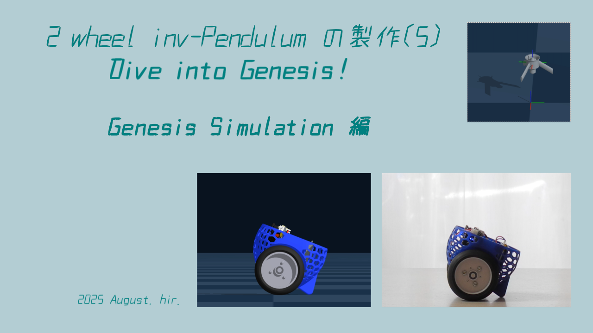

車輪型(2輪)倒立振子の製作ファイル(5) 
 
物理プラットフォーム "Genesis"の環境内で、倒立振子ロボットを動かしてみよう！ 
Try moving an inverted pendulum robot in the environment of the physics platform "Genesis" 
にて解説で使った、シミュレーションファイルのリポジトリです。 
 
製作内容は、下記youtubeをご参照下さい。 
Please refer to the YouTube link below for details of the production. 
https://www.youtube.com/watch?v=l0ogELA2urQ 
 
 
ファイルの内容について： 
inv-pend_robo_PD_control.py 
　倒立振子の model file を、genesis の環境で倒立制御(PD制御)するための実行ファイルです。 
pendulum_robot_renew (folder) 
　このフォルダーのまま、下記記載の様に通り該当する階層に copy して使用してください。 
 
Genesis 
 └ genesis 
    └ assets 
       └ urdf 
          └ pendulum_robot_renew  # this URDF dir 
             ├ meshes   
		     │  ├ xx1.dae   # my .dae files 
             │  └ xx2.dae 
             └ Robot.urdf   # my .urdf file 
 
Copyright (c) 2025/Aug/14, hir (hir4484@gmail.dom). Available under the MIT License. For more information, see LICENSE.
